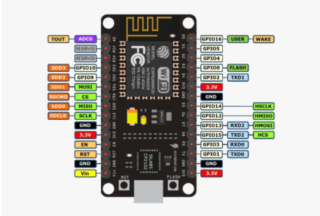
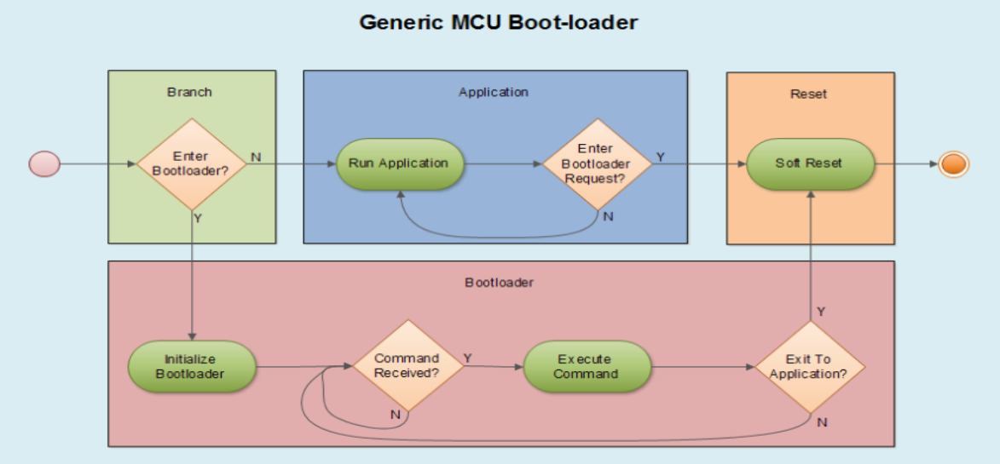
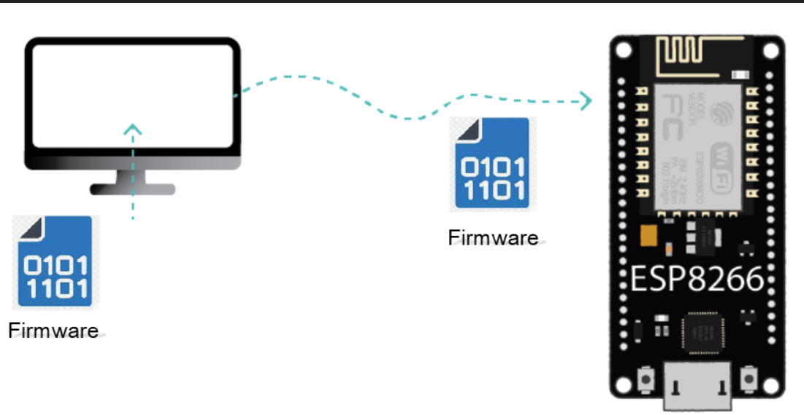
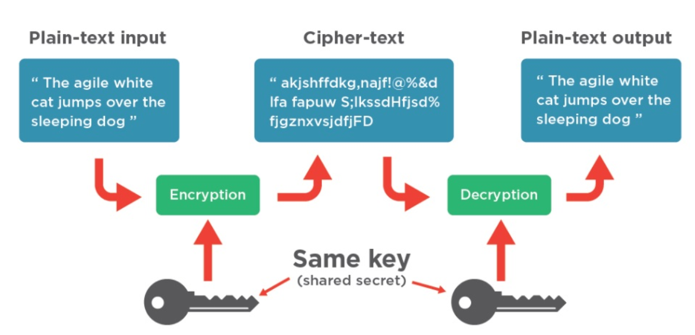

# OTA/FOTA 

  

This Repository is the FOTA Graduation Project for Mansoura Engineering College (2020-2021):

## Team Members
- **Mohamed Hafez Mohamed**
- **Abdelrhman Mosad Abdelhady**
- **Osama Salah Hijazi**

# Contents
- [Problem Statement](#Problem-Statement)
- [Problem solution](#problem-solution)
- [Obstacles of OTA ](#Obstacles-of-OTA)
  - [Connection between Server and gateway](#Connection-between-server-and-gateway)
  - [Bootloader](#Bootloader)
  - [Software Security](#Software-Security)
 
# Problem Statement

* Many embedded systems are deployed in places that are difficult or impractical for a human operator to access.This is especially true for Internet of Things (IoT) applications,with the gross of IOT fields and automotive the process of updating and keeping the software clean of bugs have been become harder and harder. 

* It is essential for companies to manage the software efficiently over the lifecycle of the device to provide improvements in performance and to deliver corrections to faulty software that endanger lives or the environment and which could result in expensive product recalls.

# Problem Solution 

OTA is the wireless delivery of new software or data to mobile devices so we can upload the new update to the cloud and devices will be connected to the cloud so it will receive the new update through any wireless communication. 

## OTA technology will provide:

1. Manage firmware updates across a fleet of IOT devices
2. Bug issues can be fixed and product behavior can be enhanced
3. It enables manufacturers to add new features to infrastructure
4. Faster time-to-market
5. Improved safety and compliance

# Obstacles of OTA

**There are three main chellanges:**

1. Connection between Server and gateway
2. Boot-loader design
3. Security of the software

## Connection between Server and gateway

  
  <d align="right">
  
</d>

* Node MCU(intermediate Gateway ECU) is an open source development board and firmware based in the widely used ESP8266-12E Wifi module,we use it to connect to internet and download the update.
 
* Firebase is the server that will connect the remote user to the ES device that the new code will be uploaded to it from remote PC so the node MCU will download code from it,its quickly and has realtime database and storage.

* Using Real time database for storing information about the update like CRC value and a flag to notify the node of new update.

* More about implementation of Intermediate Gateway and Server [NodeMcu&Firebase](https://github.com/mohamed-hafez-mohamed/Graduation_Project_2021/tree/master/04-%20Telematics%20Unit). 

## Graphical User Interface

  

* GUI is to make it easier for the user to upload updates to firebase and the relate information of the update.

* If the last update wasn’t downloaded yet by the node the application will block the user from uploading new update.

* The application will keep showing the update status till completed.

* More about implementation Graphial user Interface [Gui](https://github.com/mohamed-hafez-mohamed/Graduation_Project_2021/tree/master/05-%20GUI). 

## GateWay (OTA Manager)

  

### GateWay Responsibilities :

* Save information about connected ECUs that exist over the Network.

* Processing Decryption Algorithm of Cipher received Data From Node-Mcu.

* Verification of the Data.

* Specify the destination of the Data.

* Resolve dependencies in case of rollback. 

* Notify the node when the update is complete. 

## Bootloader 
* A boot-loader is an application whose primary purpose is to allow a systems software to be updated. 

* What makes a bootloader special is that it is sharing flash space with anotherapplication and has the capability to erase and program a newapplication in its place.

### Bootloader Design

  

* Boot-loaders can come in many different sizes and in many different flavors but in general the operation of a system with a boot-loader is relatively standard.
* There are three major components to these systems that can be seen in the Figure :
  * They are the branching code (green).
  * The application code (blue).
  * The boot-loader code (red).

**Application Behavior:**
* The application needs to be able to : 
  1. Reset the system to initiate a branching decision.
  2. Start-Up Branching.
  3. There is a flag to  decide which image to load.
* More about test cases Application [Systems application](https://github.com/mohamed-hafez-mohamed/Graduation_Project_2021/tree/master/06-%20Test%20Cases)

**Boot-loader Behavior:**
* Start the branch code to determine which code will be executed.
* If bootloader will be executed :
  1. Move the active image to backup image if exist.
  2. Receive Data Packets frame by frame on Can network bus from Gateway ECU and store it in the flash.
  4. Reset branching flag and make software reset.
* If there is an image:
  1. Check the image status and CRC to confirm it’s correctness.
  2. Execute image from the active region.
  3. If there is error detected, make flag for it.
* More about Bootloader implementation [Bootloader](https://github.com/mohamed-hafez-mohamed/Graduation_Project_2021/tree/master/02-%20BootLoader)

## Software Security

  

**The following countermeasures should be applied to secure firmware:**

1. Protect the authenticity and integrity of firmware to prevent a hacker From running modified code.
   
2. Encrypt the firmware to prevent a hacker from accessing the data.
## Advanced Encryption Standards(AES)

* The AES algorithm is a symmetric block cipher that can encrypt and decrypt data. As shown in Figure 1.
*  Encryption converts data (plain-text) to an unintelligible form called cipher-text. 
* Decryption converts this cipher-text back to the original plain-text.
*  Cryptographic keys of 128, 192, or 256 bits may be used by the AES algorithm to encrypt and decrypt data in blocks of 128 bits.

  

