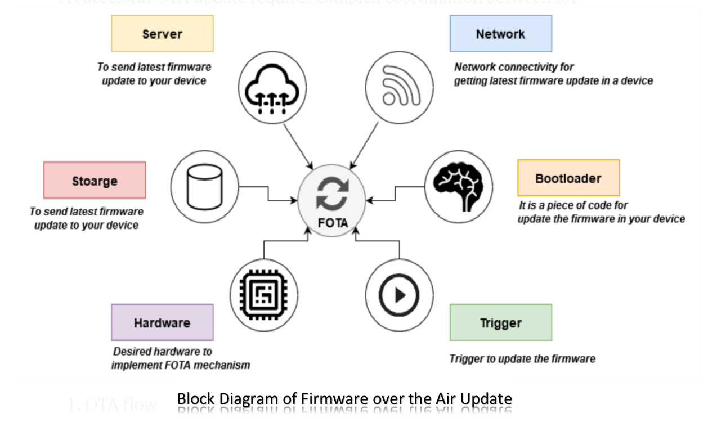
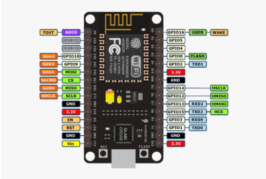
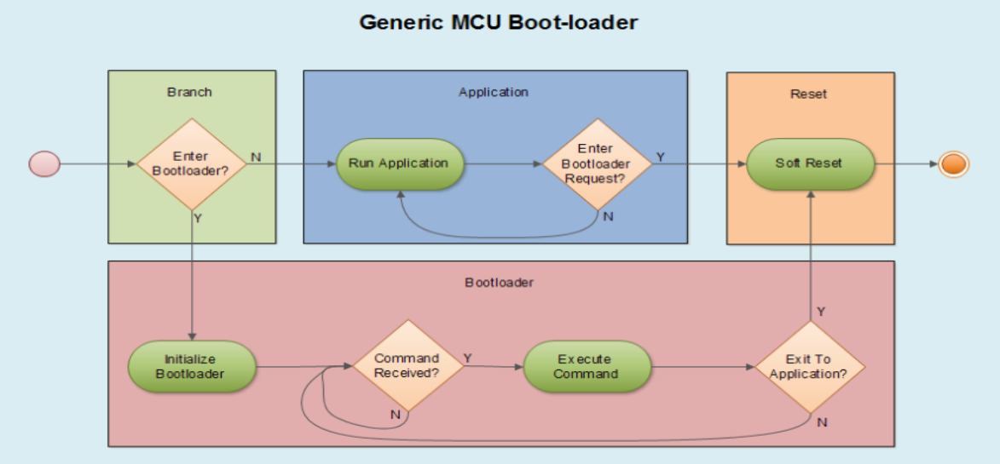

# OTA/FOTA

  

This Repository is the FOTA Graduation Project for Mansoura Engineering College (2020-2021):

### Team Members
- **Mohamed Hafez Mohamed**
- **Abdelrhman Mosad Abdelhady**
- **Osama Salah Hijazi**

## Contents
- [Problem Statement](#Problem-Statement)
- [Problem solution](#problem-solution)
- [Obstacles of OTA ](#Obstacles-of-OTA)
  - [Connection between Server and gateway](#Connection-between-server-and-gateway)
  - [Bootloader Design](#Bootloader-Design)
  - [Software Security](#Software-Security)
- [Future Enhancements](#future-enhancements)
  - [Can bus technology](#Can-bus-technology)
  - [Atutosar standards](#Atutosar-standards)
 
## Problem Statement

* Many embedded systems are deployed in places that are difficult or impractical for a human operator to access.This is especially true for Internet of Things (IoT) applications,with the gross of IOT fields and automotive the process of updating and keeping the software clean of bugs have been become harder and harder. 

* It is essential for companies to manage the software efficiently over the lifecycle of the device to provide improvements in performance and to deliver corrections to faulty software that endanger lives or the environment and which could result in expensive product recalls.

## Problem Solution 

OTA is the wireless delivery of new software or data to mobile devices so we can upload the new update to the cloud and devices will be connected to the cloud so it will receive the new update through any wireless communication. 

### OTA technology will provide:

1. Manage firmware updates across a fleet of IOT devices
2. Bug issues can be fixed and product behavior can be enhanced
3. It enables manufacturers to add new features to infrastructure
4. Faster time-to-market
5. Improved safety and compliance

## Obstacles of OTA

**There are three main chellanges:**

1. Connection between Server and gateway
2. Boot-loader design
3. Security of the software

### Connection between Server and gateway

  
  <d align="right">
  
</d>

* Node MCU(intermediate Gateway ECU) is an open source development board and firmware based in the widely used ESP8266-12E Wifi module,we use it to connect to internet and download the update.
 
* Firebase is the server that will connect the remote user to the ES device that the new code will be uploaded to it from remote PC so the node MCU will download code from it,its quickly and has realtime database and storage.

* More about implementation of Intermediate Gateway and Server [NodeMcu&Firebase](https://github.com/mohamed-hafez-mohamed/Graduation_Project_2021/tree/master/02-%20Software/Gateway/05-%20APP/NodeMcu). 

### Bootloader Design

  

* A boot-loader is an application whose primary purpose is to allow a systems software to be updated. 

* What makes a bootloader special is that it is sharing flash space with anotherapplication and has the capability to erase and program a newapplication in its place.

**Boot-loader Behavior:**

1. Start the boot-loader
2. Erase the flash.
3. Send binary file information to the boot-loader
4. apply Checksum
5. Quit the boot-loader and enter the application

* More about Bootloader implementation [Bootloader](https://github.com/mohamed-hafez-mohamed/Graduation_Project_2021/tree/master/02-%20Software/Bootloader)

### Software Security

  

**The following countermeasures should be applied to secure firmware:**

1. Protect the authenticity and integrity of firmware to prevent a hacker From running modified code.
   
2. Encrypt the firmware to prevent a hacker from accessing the data.

## Future Enhancements

### Can bus technology

1. Upgrade the Communication protocol between NodeMCU and Target Hardware (STM) and Between Gateway and other ECUs on the bus to a higher speed communication protocol (Ex: CAN - LIN - Ethernet).

### Atutosar standards

2. Integrate our Communication Software with Automotive Software Standards and Layered Architecture.    

